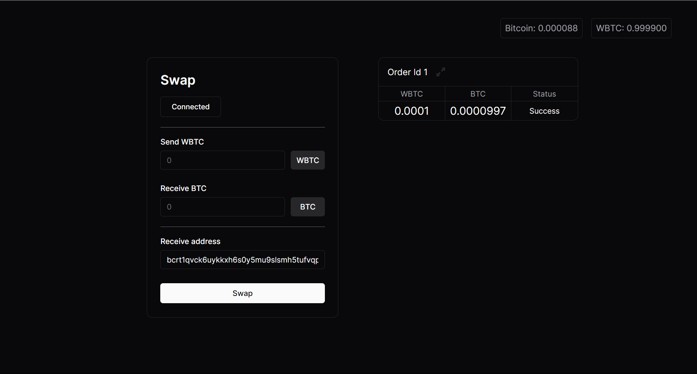
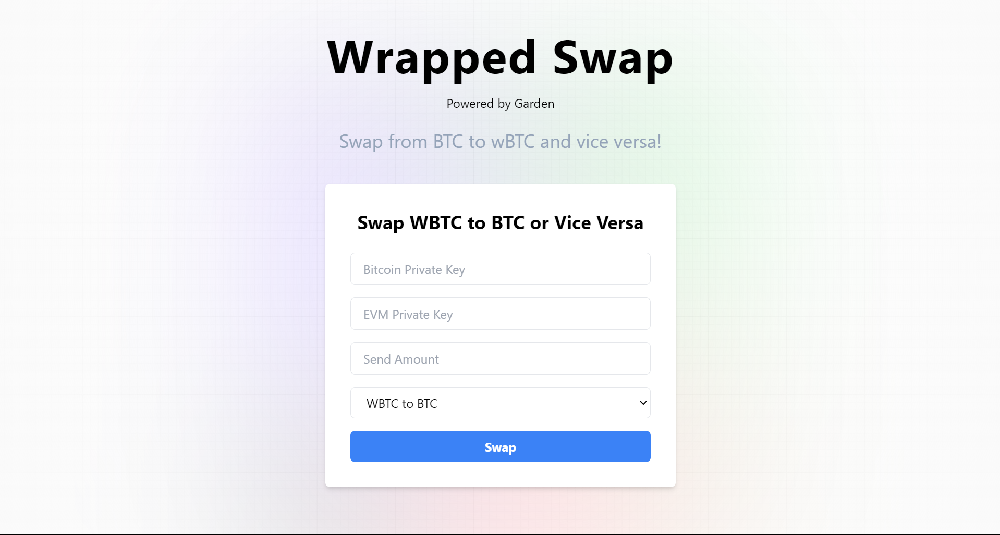

# This is the repo for Garden HH Goa 24

### This repo contains:

### 1. Local Net Implementation.
a. This was done using the demo dapp made available by Garden, and there were some changes required for the **network configuration**.

b. This was successfully tested both ways and can be found in the localNet directory.

&nbsp;

&nbsp;

&nbsp;
### 2. Test Net Implementation.
a. I used a previously build Dapp called as LandChain and implemented the **Garden SDK**.

b. I trequires you to enter your Bitcoin and Ethereum private key and then utilizes it to spin up a wallet as well as swap the entered amount.

c. It has a drop-down which allows the uses to quickly shift whether to swpa from *BTC to wBTC or vice versa* .

